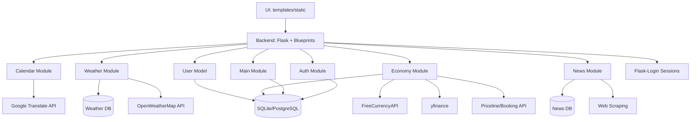

# Architektura aplikacji (wspólna)

Ten plik opisuje **wspólne elementy całej aplikacji**.  
Szczegóły modułów znajdują się w:
- [`architecture/auth.md`](architecture/auth.md)
- [`architecture/calendar.md`](architecture/calendar.md)
- [`architecture/weather.md`](architecture/weather.md)
- [`architecture/economy.md`](architecture/economy.md)
- [`architecture/news.md`](architecture/news.md)

---

## 1. Cel i zakres architektury

Dokument ten opisuje wspólne elementy architektury aplikacji Serwis Informacyjny, niezależne od konkretnych modułów funkcjonalnych. Obejmuje on widok systemu jako całości, wspólny stos technologiczny, konwencje w repozytorium, przepływ danych na poziomie aplikacji, wspólny model danych (encja User), aspekty przekrojowe (konfiguracja, logowanie, bezpieczeństwo) oraz decyzje architektoniczne. Dokument nie zawiera szczegółowych opisów architektury poszczególnych modułów (auth, calendar, weather, economy, news) ani szczegółowej specyfikacji endpointów – te informacje znajdują się odpowiednio w dokumentacji modułów (`architecture/<module>.md`) oraz w referencji API (`api_reference.md`).

---

## 2. Widok systemu jako całości

Aplikacja Serwis Informacyjny składa się z następujących głównych elementów:

- **Warstwa UI (Frontend)** – szablony HTML, style CSS oraz skrypty JavaScript (`templates/`, `static/`) odpowiedzialne za prezentację danych użytkownikowi i interakcję z interfejsem
- **Backend (Flask)** – aplikacja Flask z architekturą modułową opartą na blueprintach, obsługująca routing, logikę biznesową oraz integracje z zewnętrznymi API
- **Warstwa danych (Database)** – bazy danych SQLite (lokalnie) i PostgreSQL (produkcja) przechowujące dane użytkowników, preferencje oraz dane modułowe (pogoda, wiadomości)
- **Moduły funkcjonalne** – niezależne moduły (auth, calendar, weather, economy, news, main) zorganizowane w strukturze `serwis_info/modules/`, każdy z własnymi routes, templates i services
- **Integracje zewnętrzne** – połączenia z zewnętrznymi API: OpenWeatherMap (pogoda), FreeCurrencyAPI (waluty), yfinance (giełda), Priceline/Booking.com (podróże), Google Translate (tłumaczenia), oraz scrapowanie wiadomości
- **System autentykacji** – Flask-Login do zarządzania sesjami użytkowników oraz moduł auth obsługujący rejestrację, logowanie i zarządzanie kontem
- **Warstwa testowa** – testy jednostkowe (pytest), integracyjne oraz end-to-end (Playwright) zapewniające jakość kodu
- **Hosting** – aplikacja hostowana na Amazon EC2 (AWS) z konfiguracją środowiska produkcyjnego

---

## 3. Stos technologiczny (wspólny)

Poniższa tabela przedstawia wspólne technologie używane w całej aplikacji. Biblioteki specyficzne dla poszczególnych modułów (np. OpenWeatherMap API, yfinance) są opisane w dokumentacji odpowiednich modułów.

| Obszar | Technologia | Wersja | Rola w systemie / uzasadnienie |
|---|---|---:|---|
| Backend | Flask | najnowsza | Framework webowy do budowy aplikacji, obsługa routing, blueprinty modułowe, integracja z bazą danych |
| Frontend | HTML/CSS/JS | - | Warstwa prezentacji: szablony Jinja2, style CSS, interaktywność JavaScript (AJAX, karuzele, mapy) |
| Baza danych | SQLite (dev) / PostgreSQL (prod) | - | Przechowywanie danych użytkowników (User), preferencji modułowych oraz danych modułowych (pogoda, wiadomości) |
| ORM | Flask-SQLAlchemy | najnowsza | Abstrakcja dostępu do bazy danych, modele danych, migracje |
| Autentykacja | Flask-Login | najnowsza | Zarządzanie sesjami użytkowników, ochrona endpointów wymagających logowania |
| Formularze | Flask-WTF | najnowsza | Walidacja formularzy, ochrona CSRF, integracja z szablonami |
| Konfiguracja | python-dotenv | najnowsza | Ładowanie zmiennych środowiskowych z pliku `.env` (sekrety, klucze API) |
| Testy | pytest / Playwright | najnowsza | Testy jednostkowe i integracyjne (pytest), testy end-to-end (Playwright) |
| Hosting | AWS EC2 | - | Hosting aplikacji w środowisku produkcyjnym na instancji Amazon EC2 |

---

## 4. Konwencje i standardy w repozytorium

### 4.1 Struktura katalogów (skrót)

Główne katalogi projektu:

- **`app/`** – moduł autentykacji (auth) z routes, forms oraz wspólne modele (User)
- **`serwis_info/`** – główny pakiet aplikacji zawierający:
  - `create_app.py` – factory function tworząca instancję aplikacji Flask
  - `modules/` – moduły funkcjonalne (main, calendar, weather, economy, news), każdy z własnymi routes, templates, static, services
- **`templates/`** – wspólne szablony HTML (navbar, base template)
- **`static/`** – wspólne zasoby statyczne (CSS, JS, obrazy)
- **`tests/`** – testy aplikacji podzielone na unit, integration oraz e2e
- **`docs/`** – dokumentacja projektu (architecture, api_reference, setup, testing, itp.)
- **`env/`** – katalog zawierający plik `.env` z konfiguracją (nie jest commitowany do repo)
- **`config.py`** – konfiguracja aplikacji (Config, TestingConfig)
- **`app.py`** – punkt wejścia aplikacji (uruchomienie serwera deweloperskiego)

### 4.2 Konwencje nazewnictwa

Konwencje nazewnictwa w projekcie:

- **Blueprinty:** `*_bp` (np. `main_bp`, `auth_bp`, `horoscope_bp`) z prefixem URL (np. `/auth`, `/main`, `/calendar`)
- **Endpointy:** RESTful style, rzeczowniki w liczbie mnogiej dla kolekcji (np. `/currencies`, `/stockmarket`), czasowniki dla akcji (np. `/login`, `/register`)
- **Nazwy plików:** snake_case dla plików Python (np. `horoscope_routes.py`, `news_page.py`), kebab-case dla szablonów HTML (np. `account_settings.html`)
- **Klasy:** PascalCase (np. `User`, `Config`, `RegisterForm`)
- **Funkcje:** snake_case (np. `create_app`, `load_user`, `get_calendar_data`)
- **Zmienne:** snake_case (np. `current_user`, `news_preview`, `show_welcome_modal`)
- **Moduły:** katalogi w `serwis_info/modules/` odpowiadają nazwom modułów (calendar, weather, economy, news, main)

### 4.3 Wspólne biblioteki / utilities

Wspólne biblioteki i narzędzia używane w całej aplikacji:

- **`config.py`** – klasa `Config` ładująca zmienne środowiskowe z `.env` (SECRET_KEY, klucze API), konfiguracja SQLAlchemy
- **`python-dotenv`** – ładowanie zmiennych środowiskowych z pliku `env/.env`
- **`werkzeug.security`** – hashowanie haseł (generate_password_hash, check_password_hash) w modelu User
- **`flask_login`** – zarządzanie sesjami użytkowników, dekoratory `@login_required`, `current_user`
- **`flask`** – podstawowe narzędzia: `render_template`, `redirect`, `url_for`, `flash`, `session`, `jsonify`
- **`requests`** – wykonywanie zapytań HTTP do zewnętrznych API (używane w modułach weather, economy, news)
- **`googletrans`** – tłumaczenie tekstów (używane w module calendar do tłumaczenia horoskopów)
- **`threading`** – asynchroniczne pobieranie danych w tle (używane w module main do cache'owania danych ekonomicznych)

---

## 5. Komponenty i zależności

### 5.1 Diagram architektury (wymagany)

Diagram przedstawiający elementy systemu: UI → Flask → DB → API zewnętrzne.

Diagram przedstawia główne komponenty systemu: warstwę UI, backend Flask z modułami funkcjonalnymi, bazy danych (główna oraz modułowe), model użytkownika oraz integracje z zewnętrznymi API.

---

## 6. Przepływ danych (Data Flow)
Opis dotyczy ogólnego przepływu danych w aplikacji, niezależnie od konkretnego modułu.

### 6.1 Przepływ danych od użytkownika do bazy danych

1. **Żądanie HTTP** – użytkownik wysyła żądanie przez przeglądarkę (GET/POST) do endpointu Flask
2. **Routing i autoryzacja** – Flask-Login weryfikuje sesję użytkownika (jeśli endpoint wymaga `@login_required`)
3. **Walidacja danych** – formularze są walidowane przez Flask-WTF (RegisterForm, LoginForm, ChangePasswordForm)
4. **Przetwarzanie logiki biznesowej** – blueprinty modułów wykonują logikę (pobieranie z API, obliczenia, transformacje)
5. **Zapis do bazy danych** – dane są zapisywane przez SQLAlchemy (User, preferencje modułowe) lub bezpośrednio do SQLite (moduły weather, news)
6. **Odpowiedź** – Flask zwraca HTML (render_template) lub JSON (jsonify) do przeglądarki

### 6.2 Przepływ danych z zewnętrznych API

1. **Żądanie do API** – moduły wysyłają zapytania HTTP (requests) do zewnętrznych API (pogoda, waluty, wiadomości)
2. **Odpowiedź API** – dane są otrzymywane w formacie JSON
3. **Przetwarzanie i transformacja** – dane są parsowane, filtrowane i formatowane do struktury używanej w aplikacji
4. **Cache'owanie (opcjonalne)** – niektóre dane są cache'owane lokalnie (pliki JSON w module main dla danych ekonomicznych)
5. **Prezentacja** – dane są wyświetlane w szablonach HTML lub zwracane jako JSON do frontendu (AJAX)

### 6.3 Przepływ danych z bazy do widoków

1. **Odczyt z bazy** – SQLAlchemy wykonuje zapytania (User.query, db.session.query) lub bezpośrednie zapytania SQL (moduły weather, news)
2. **Serializacja** – dane z modeli są konwertowane do formatu używanego w szablonach (słowniki, listy)
3. **Renderowanie** – Jinja2 renderuje szablony HTML z danymi
4. **Odpowiedź HTTP** – przeglądarka otrzymuje gotowy HTML z danymi

---

## 7. Model danych (część wspólna)

### Cel sekcji

Celem tej sekcji jest opisanie **wspólnego modelu danych aplikacji**, czyli encji
i relacji, które mają charakter **przekrojowy** i nie są przypisane wyłącznie
do jednego modułu systemu.

> **Ważne:**  
> W tej sekcji **nie opisujemy danych stricte modułowych**  
> (np. danych pogodowych, ekonomicznych, wiadomości itp.).  
> Dane specyficzne dla poszczególnych modułów należy opisać
> w dokumentacji architektury odpowiednich modułów:
> `docs/architecture/<module>.md`.

---

### 7.1 Zakres modelu danych wspólnego

Wspólny model danych obejmuje **encje bazodanowe**, które spełniają
co najmniej jedno z poniższych kryteriów:

- są wykorzystywane przez **więcej niż jeden moduł aplikacji**,  
- stanowią **rdzeń systemu**, niezależnie od modułów
  (np. użytkownicy, sesje, logi, konfiguracja),
- realizują **funkcje przekrojowe** (cross-cutting concerns),
  takie jak bezpieczeństwo, audyt czy monitorowanie.

Encje, które są używane **wyłącznie w jednym module**,
powinny być opisane w dokumentacji architektury tego modułu.

---

### 7.2 Encje wspólne i ich odpowiedzialność

W tej podsekcji należy opisać **encje wspólne aplikacji**.

Dla każdej encji należy podać:
- nazwę encji (tabeli),
- krótką charakterystykę jej roli w systemie,
- najważniejsze atrybuty (bez opisywania wszystkich pól),
- relacje z innymi encjami wspólnymi lub modułami.

#### Encja: User

**Rola:** Reprezentuje użytkownika aplikacji i jest wykorzystywana przez wiele modułów (auth, main, economy, weather, news). Stanowi podstawę systemu autentykacji i personalizacji.

**Najważniejsze atrybuty:**
- `id` (Integer, PK) – unikalny identyfikator użytkownika
- `email` (String, unique, nullable=False) – adres e-mail użytkownika (używany do logowania)
- `nickname` (String, unique, nullable=False) – pseudonim użytkownika (wyświetlany w interfejsie)
- `password_hash` (String, nullable=False) – zahashowane hasło użytkownika (Werkzeug)
- `created_at` (DateTime) – data utworzenia konta

**Relacje:**
- **User → UserEconomyPreferences (1:1)** – preferencje ekonomiczne użytkownika (ulubione akcje, waluty) w module economy
- **User → Weather History (1:N)** – historia wyszukiwań pogody w module weather (przechowywana w SQLite)
- **User → News Bookmarks (1:N)** – zakładki wiadomości w module news (przechowywane w SQLite)
- **User → Flask-Login Session (1:N)** – sesje użytkownika zarządzane przez Flask-Login

**Uzasadnienie wspólnego charakteru:** Encja User jest wykorzystywana przez moduły auth (rejestracja, logowanie), main (zarządzanie kontem), economy (preferencje), weather (historia) oraz news (zakładki), dlatego stanowi część wspólnego modelu danych.

## 8. Cross-cutting concerns (wspólne aspekty)

### 8.1 Konfiguracja i sekrety (.env)

Konfiguracja aplikacji jest zarządzana przez klasę `Config` w pliku `config.py`, która ładuje zmienne środowiskowe z pliku `env/.env` za pomocą biblioteki `python-dotenv`.

**Gdzie ładowane:** Zmienne są ładowane przy starcie aplikacji przez `load_dotenv(ENV_FILE)`, gdzie `ENV_FILE = BASE_DIR / "env" / ".env"`.

**Zabezpieczenie:** Plik `.env` zawiera sekrety (SECRET_KEY, klucze API) i **nie jest commitowany do repozytorium** (dodany do `.gitignore`). W repozytorium powinien znajdować się plik `.env.example` z przykładowymi nazwami zmiennych bez wartości.

**Zmienne środowiskowe używane w aplikacji:**
- `SECRET_KEY` – klucz sesji Flask (wymagany)
- `CURRENCY_API_KEY` – klucz do FreeCurrencyAPI (moduł economy)
- `RAPIDAPI_KEY`, `RAPIDAPI_HOST_PRICELINE`, `RAPIDAPI_HOST_BOOKING` – klucze do API podróży (moduł economy)
- `OPENWEATHER_API_KEY` – klucz do OpenWeatherMap API (moduł weather)

Szczegóły: [`setup.md`](setup.md)

### 8.2 Obsługa błędów i logowanie

**Logowanie:** Aplikacja wykorzystuje wbudowany system logowania Flask (`app.logger`). W trybie deweloperskim (`debug=True`) logi są wyświetlane w konsoli. W produkcji logi powinny być przekierowane do pliku lub systemu zarządzania logami.

**Obsługa błędów:**
- **Walidacja formularzy** – Flask-WTF automatycznie waliduje dane i zwraca błędy w formularzach (wyświetlane przez `flash()`)
- **Obsługa wyjątków API** – moduły obsługują błędy zewnętrznych API (try/except) i zwracają komunikaty użytkownikowi lub wartości domyślne
- **Komunikaty błędów** – użytkownik otrzymuje komunikaty przez `flash()` z kategoriami ('success', 'danger', 'warning')
- **Błędy autoryzacji** – Flask-Login automatycznie przekierowuje niezalogowanych użytkowników do `/auth/login` dla endpointów z `@login_required`

**Format logów:** Standardowy format Flask (timestamp, level, message). W trybie debug dodatkowe informacje o stack trace.

### 8.3 Bezpieczeństwo (minimum)

**Walidacja danych:**
- **Formularze** – Flask-WTF zapewnia walidację po stronie serwera (email, hasło, wymagane pola)
- **Hasła** – hasła są hashowane za pomocą Werkzeug (PBKDF2) przed zapisem do bazy danych
- **SQL Injection** – SQLAlchemy używa parametryzowanych zapytań, co chroni przed SQL injection
- **XSS** – Jinja2 automatycznie escapuje zmienne w szablonach HTML

**Sekrety:**
- Plik `.env` z sekretami **nie jest commitowany do repozytorium** (dodany do `.gitignore`)
- Klucze API i SECRET_KEY są przechowywane tylko w zmiennych środowiskowych
- W repozytorium powinien być plik `.env.example` bez wartości sekretów

**Zabezpieczenia formularzy:**
- **CSRF Protection** – Flask-WTF automatycznie generuje i weryfikuje tokeny CSRF dla formularzy
- **Sesje** – Flask-Login zarządza sesjami użytkowników, cookies są zabezpieczone
- **Hasła** – minimalne wymagania dla haseł (długość, złożoność) są walidowane w formularzach

**Ograniczenia:** Brak obsługi resetowania hasła przez e-mail, brak rate limiting dla API, brak szyfrowania danych w bazie (poza hasłami).

---

## 9. Decyzje architektoniczne (ADR-lite)

- **Decyzja:** Użycie Flask z architekturą modułową opartą na blueprintach  
  **Powód:** Umożliwia podział aplikacji na niezależne moduły (auth, calendar, weather, economy, news), co ułatwia równoległą pracę zespołów i utrzymanie kodu  
  **Konsekwencje:** Każdy moduł ma własne routes, templates, static i services, co zwiększa modularność, ale wymaga spójnych konwencji nazewnictwa

- **Decyzja:** SQLite dla modułów weather i news (osobne bazy danych) zamiast wspólnej bazy  
  **Powód:** Umożliwia niezależne zarządzanie danymi modułowymi, łatwiejsze backupowanie i potencjalne przeniesienie modułów do osobnych serwisów  
  **Konsekwencje:** Trzy osobne bazy danych (główna database.db, weather/users.db, news/news.db), co wymaga osobnych połączeń i zarządzania

- **Decyzja:** Flask-Login do zarządzania sesjami zamiast własnego systemu autentykacji  
  **Powód:** Sprawdzone, bezpieczne rozwiązanie, minimalizuje ryzyko błędów bezpieczeństwa, łatwa integracja z Flask  
  **Konsekwencje:** Zależność od zewnętrznej biblioteki, ale uproszczona implementacja autoryzacji w całej aplikacji

- **Decyzja:** Cache'owanie danych ekonomicznych w plikach JSON zamiast bazy danych lub Redis  
  **Powód:** Proste rozwiązanie dla danych, które nie wymagają częstego odświeżania, brak potrzeby dodatkowej infrastruktury  
  **Konsekwencje:** Cache jest lokalny (nie współdzielony między instancjami), możliwe problemy z synchronizacją w środowisku produkcyjnym z wieloma serwerami

- **Decyzja:** Użycie Google Translate API do tłumaczenia horoskopów  
  **Powód:** Publiczne API, brak potrzeby własnego systemu tłumaczeń, szybka implementacja  
  **Konsekwencje:** Zależność od zewnętrznego serwisu, możliwe limity API, koszty przy większym ruchu

- **Decyzja:** Hosting na Amazon EC2 zamiast serwerless (Lambda) lub platformy zarządzanej (Heroku)  
  **Powód:** Pełna kontrola nad środowiskiem, możliwość konfiguracji, niższe koszty przy przewidywalnym obciążeniu  
  **Konsekwencje:** Wymaga zarządzania serwerem, aktualizacji, backupów, większa odpowiedzialność za infrastrukturę

- **Decyzja:** Testy E2E z Playwright zamiast Selenium  
  **Powód:** Szybsze wykonanie testów, lepsza integracja z pytest, nowoczesne API  
  **Konsekwencje:** Wymaga instalacji przeglądarek przez Playwright, ale zapewnia stabilne testy end-to-end  

---

## 10. Powiązanie architektury z modułami

Linki do architektury modułów:
- Auth: [`architecture/auth.md`](architecture/auth.md) – moduł autentykacji (rejestracja, logowanie, zarządzanie kontem)
- Calendar: [`architecture/calendar.md`](architecture/calendar.md) – moduł kalendarza (horoskopy, święta, imieniny)
- Weather: [`architecture/weather.md`](architecture/weather.md) – moduł pogodowy (prognozy, mapa, historia)
- Economy: [`architecture/economy.md`](architecture/economy.md) – moduł ekonomiczny (waluty, giełda, podróże)
- News: [`architecture/news.md`](architecture/news.md) – moduł wiadomości (sport, kryminalne, zakładki)

---

## 11. Ograniczenia, ryzyka i dalszy rozwój

### Ograniczenia

- **Baza danych:** SQLite w środowisku lokalnym nie jest optymalna dla produkcji z większym obciążeniem (brak współbieżności zapisu)
- **Cache lokalny:** Cache'owanie danych ekonomicznych w plikach JSON nie działa w środowisku z wieloma instancjami serwera
- **Brak rate limiting:** Brak ograniczeń liczby żądań do API, co może prowadzić do przekroczenia limitów zewnętrznych API
- **Brak resetowania hasła:** Brak funkcjonalności resetowania hasła przez e-mail
- **Zależność od zewnętrznych API:** Aplikacja jest zależna od dostępności zewnętrznych API (pogoda, waluty, tłumaczenia)

### Ryzyka

- **Awaryjność API:** Jeśli zewnętrzne API są niedostępne, funkcjonalności modułów przestają działać (brak fallbacków)
- **Bezpieczeństwo:** Brak szyfrowania danych w bazie (poza hasłami), brak HTTPS enforcement w kodzie
- **Skalowalność:** SQLite i lokalne cache nie skalują się dobrze przy większym obciążeniu
- **Koszty API:** Użycie Google Translate API i innych płatnych API może generować koszty przy większym ruchu

### Propozycje usprawnień

- [ ] Migracja z SQLite na PostgreSQL dla wszystkich modułów w produkcji
- [ ] Implementacja centralnego cache (Redis) zamiast plików JSON
- [ ] Dodanie rate limiting dla endpointów API
- [ ] Implementacja resetowania hasła przez e-mail
- [ ] Dodanie fallbacków dla zewnętrznych API (cache'owanie, wartości domyślne)
- [ ] Implementacja HTTPS enforcement i dodatkowych zabezpieczeń
- [ ] Dodanie monitoringu i alertów dla błędów API
- [ ] Optymalizacja zapytań do bazy danych i dodanie indeksów
- [ ] Implementacja systemu kolejkowania zadań (Celery) dla długotrwałych operacji (scrapowanie wiadomości)
