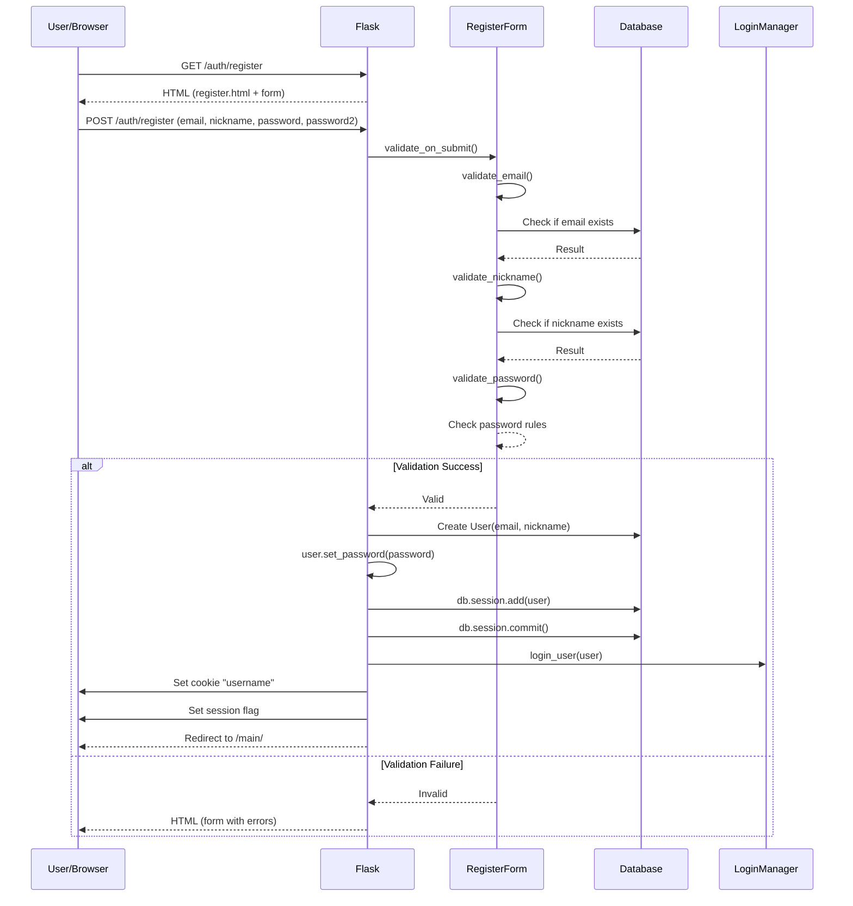
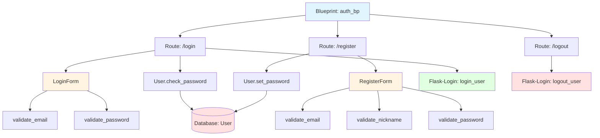

# Architektura modułu: Moduł Logowania (Authentication)

> **Cel dokumentu:**  
> Ten dokument odpowiada na pytanie: **„Jak ten konkretny moduł działa i na jakich danych operuje?”**  
>
> Ten plik opisuje architekturę **modułu logowania**, który odpowiada za rejestrację, logowanie, wylogowanie oraz zarządzanie kontem użytkownika.

---

## 1. Cel modułu

Moduł logowania (Authentication) jest odpowiedzialny za zarządzanie użytkownikami aplikacji. Moduł zapewnia następujące funkcjonalności:
- **Rejestracja użytkowników** – tworzenie nowych kont z walidacją danych
- **Logowanie** – uwierzytelnianie użytkowników i zarządzanie sesjami
- **Wylogowanie** – bezpieczne zakończenie sesji użytkownika
- **Zarządzanie kontem** – zmiana hasła, usuwanie konta

Moduł wykorzystuje Flask-Login do zarządzania sesjami oraz Werkzeug do bezpiecznego hashowania haseł. Wszystkie hasła są przechowywane jako hashe w bazie danych.

---

## 2. Zakres funkcjonalny (powiązanie z User Stories)

- **US-AUTH-001** — Jako użytkownik niezalogowany chcę móc zalogować się na istniejące już konto, aby uzyskać dostęp do funkcjonalności wymagających autoryzacji.
- **US-AUTH-002** — Jako użytkownik nieposiadający konta w aplikacji chcę móc założyć konto oraz otrzymać e-mail z potwierdzeniem jego utworzenia, aby móc korzystać z aplikacji i otrzymać potwierdzenie rejestracji.
- **US-AUTH-003** — Jako zalogowany użytkownik chcę móc zachować swoje preferencje, aby aplikacja zapamiętywała moje ustawienia i wybory.

Pełna lista User Stories znajduje się w: [`docs/specification/user_stories.md`](../specification/user_stories.md)

---

## 3. Granice modułu (co wchodzi / co nie wchodzi)

### 3.1 Moduł odpowiada za

- Rejestrację nowych użytkowników z walidacją
- Logowanie i wylogowanie użytkowników
- Zarządzanie sesjami użytkowników (Flask-Login)
- Hashowanie i weryfikację haseł
- Walidację formularzy rejestracji i logowania
- Zmianę hasła użytkownika
- Usuwanie konta użytkownika
- Ustawianie cookies z nickiem użytkownika

### 3.2 Moduł nie odpowiada za

- Resetowanie hasła przez e-mail (niezaimplementowane)
- Potwierdzenie e-maila po rejestracji (niezaimplementowane)
- Autoryzację na poziomie ról/permissions (aplikacja ma jedną rolę użytkownika)
- Profil użytkownika poza danymi logowania (to jest w module głównym)

---

## 4. Struktura kodu modułu

Moduł logowania ma następującą strukturę:

```
app/
├── __init__.py              # Inicjalizacja Flask-Login i bazy danych
├── auth/
│   ├── __init__.py          # Definicja blueprintu auth_bp
│   └── routes.py            # Endpointy: login, register, logout
├── forms.py                 # Formularze: RegisterForm, LoginForm, ChangePasswordForm
└── models.py                # Model User z metodami hashowania haseł
```

**Pliki kluczowe:**
- `app/auth/routes.py` – endpointy HTTP dla logowania, rejestracji, wylogowania
- `app/forms.py` – formularze WTForms z walidacją
- `app/models.py` – model `User` z metodami `set_password()` i `check_password()`
- `app/__init__.py` – konfiguracja Flask-Login i `login_manager`

**Uwaga:** Zarządzanie kontem (zmiana hasła, usuwanie) jest zaimplementowane w module głównym (`serwis_info/modules/main/routes/main.py`), ale wykorzystuje modele i formularze z modułu auth.

---

## 5. Interfejs modułu

>**Uwaga:**  
>Nie powielamy szczegółów request/response – pełna specyfikacja znajduje się w [`docs/api_reference.md`](../api_reference.md).

Poniżej przedstawiono endpointy udostępniane przez ten moduł.
Szczegółowa specyfikacja każdego endpointu (parametry, odpowiedzi, błędy)
znajduje się w pliku [`docs/api_reference.md`](../api_reference.md).

| Metoda | Ścieżka | Typ | Rola w module | Powiązane User Stories | Szczegóły |
|---:|---|---|---|---|---|
| GET | `/auth/login` | HTML | Formularz logowania | US-AUTH-001 | [`api_reference.md`](../api_reference.md#get-authlogin) |
| POST | `/auth/login` | HTML/Redirect | Proces logowania | US-AUTH-001 | [`api_reference.md`](../api_reference.md#post-authlogin) |
| GET | `/auth/register` | HTML | Formularz rejestracji | US-AUTH-002 | [`api_reference.md`](../api_reference.md#get-authregister) |
| POST | `/auth/register` | HTML/Redirect | Proces rejestracji | US-AUTH-002 | [`api_reference.md`](../api_reference.md#post-authregister) |
| GET | `/auth/logout` | Redirect | Wylogowanie użytkownika | US-AUTH-001 | [`api_reference.md`](../api_reference.md#get-authlogout) |

**Dodatkowe endpointy (w module głównym, wykorzystujące auth):**
- `GET /main/account` – ustawienia konta (wymaga logowania)
- `GET /main/account/more-options` – dodatkowe opcje konta (wymaga logowania)
- `POST /main/account/change-password` – zmiana hasła (wymaga logowania)
- `POST /main/account/delete` – usunięcie konta (wymaga logowania)

---

## 6. Zewnętrzne API wykorzystywane przez moduł

Moduł logowania **nie korzysta z zewnętrznych API**. 
Wszystkie operacje są wykonywane lokalnie w aplikacji i bazie danych.

### 6.1 Biblioteki zewnętrzne

Moduł wykorzystuje następujące biblioteki:
- **Flask-Login** – zarządzanie sesjami użytkowników
- **Werkzeug** – hashowanie haseł (PBKDF2)
- **WTForms / Flask-WTF** – formularze i walidacja
- **Flask-SQLAlchemy** – ORM do pracy z bazą danych

---

## 7. Model danych modułu

### 7.1 Encje bazodanowe (tabele)

#### Encja: User

Reprezentuje użytkownika aplikacji.

**Nazwa tabeli:** `user`

**Pola:**
- `id` (Integer, Primary Key) – unikalny identyfikator użytkownika
- `email` (String(120), Unique, Not Null) – adres e-mail użytkownika (używany do logowania)
- `nickname` (String(64), Unique, Not Null) – nazwa użytkownika wyświetlana w aplikacji
- `password_hash` (String(200), Not Null) – zahashowane hasło użytkownika (PBKDF2)
- `created_at` (DateTime, Nullable, Default: UTC now) – data utworzenia konta

**Relacje:**
- Moduł logowania nie definiuje bezpośrednich relacji z innymi encjami, ale encja `User` jest wykorzystywana przez inne moduły (np. moduł pogodowy może przechowywać ulubione lokalizacje użytkownika).

**Metody modelu:**
- `set_password(password)` – hashowanie i ustawienie hasła
- `check_password(password)` – weryfikacja hasła
- `__repr__()` – reprezentacja string użytkownika

**Przykład użycia:**
```python
# Tworzenie użytkownika
user = User(email="user@example.com", nickname="jan_kowalski")
user.set_password("SecurePass123!")
db.session.add(user)
db.session.commit()

# Weryfikacja hasła
if user.check_password("SecurePass123!"):
    login_user(user)
```

### 7.2 Obiekty domenowe (bez tabel w bazie)

#### Sesja użytkownika (Flask-Login)

Flask-Login zarządza sesjami użytkowników poprzez:
- Cookie sesyjne w przeglądarce
- Obiekt `current_user` dostępny w kontekście Flask
- Dekorator `@login_required` do ochrony endpointów

**Informacje w sesji:**
- `user_id` – identyfikator zalogowanego użytkownika
- Flaga `is_authenticated` – czy użytkownik jest zalogowany

#### Cookie z nickiem użytkownika

Moduł ustawia dodatkowe cookie `username` z nickiem użytkownika:
- Wartość: nickname użytkownika
- Czas wygaśnięcia: 7 dni
- Używane do wyświetlania nazwy użytkownika w interfejsie

### 7.3 Relacje i przepływ danych

1. **Rejestracja użytkownika:**
   ```
   Formularz → Walidacja → Hashowanie hasła → Zapis do DB → Logowanie → Redirect
   ```

2. **Logowanie użytkownika:**
   ```
   Formularz → Weryfikacja email/hasło → Flask-Login session → Cookie → Redirect
   ```

3. **Wylogowanie:**
   ```
   Request → Flask-Login logout → Usunięcie cookie → Redirect do logowania
   ```

4. **Zmiana hasła:**
   ```
   Formularz → Weryfikacja obecnego hasła → Hashowanie nowego hasła → Aktualizacja DB → Wylogowanie → Redirect
   ```

5. **Usunięcie konta:**
   ```
   Request → Wylogowanie → Usunięcie z DB → Redirect do logowania
   ```

---

## 8. Przepływ danych w module

**Scenariusz:** Nowy użytkownik rejestruje konto

1. Użytkownik otwiera `/auth/register`
2. Flask renderuje formularz rejestracji (`RegisterForm`)
3. Użytkownik wypełnia formularz (email, nickname, hasło, powtórzenie hasła)
4. Po wysłaniu formularza (POST), następuje walidacja:
   - Email: format e-mail, unikalność w bazie
   - Nickname: 3-64 znaki, unikalność w bazie
   - Hasło: minimum 8 znaków, wielka litera, mała litera, cyfra, znak specjalny
   - Powtórzenie hasła: zgodność z hasłem
5. Jeśli walidacja przechodzi, tworzony jest nowy obiekt `User`
6. Hasło jest hashowane przez `user.set_password()`
7. Użytkownik jest zapisywany do bazy danych
8. Użytkownik jest automatycznie logowany przez `login_user(user)`
9. Ustawiane jest cookie `username` z nickiem
10. Ustawiana jest flaga sesji `show_welcome_modal` dla powitalnego modala
11. Użytkownik jest przekierowywany do strony głównej

---

## 9. Diagramy modułu (wymagane)

### 9.1 Diagram sekwencji (dla User Story: "Rejestracja nowego użytkownika")



### 9.2 Diagram komponentów modułu



---

## 10. Testowanie modułu

Szczegóły: [`docs/testing.md`](../testing.md)

### 10.1 Unit tests (pytest)

**Testowane funkcje:**
- `User.set_password(password)` – poprawność hashowania
- `User.check_password(password)` – weryfikacja hasła (poprawne i niepoprawne)
- Walidacja formularzy:
  - `RegisterForm.validate_email()` – unikalność, format
  - `RegisterForm.validate_nickname()` – unikalność, długość
  - `RegisterForm.validate_password()` – reguły bezpieczeństwa hasła
  - `LoginForm` – podstawowa walidacja

**Przykładowe testy:**
- Test hashowania i weryfikacji hasła
- Test walidacji unikalności emaila i nicku
- Test walidacji siły hasła (wielka litera, mała litera, cyfra, znak specjalny)
- Test walidacji długości hasła (minimum 8 znaków)

### 10.2 Integration tests (HTML/API)

**Testowane endpointy:**
- `GET /auth/login` – renderowanie formularza logowania
- `POST /auth/login` – logowanie z poprawnymi danymi
- `POST /auth/login` – logowanie z niepoprawnymi danymi
- `GET /auth/register` – renderowanie formularza rejestracji
- `POST /auth/register` – rejestracja z poprawnymi danymi
- `POST /auth/register` – rejestracja z niepoprawnymi danymi (duplikaty, słabe hasło)
- `GET /auth/logout` – wylogowanie (wymaga logowania)

**Wymagania:**
- Testowanie kodów odpowiedzi HTTP
- Testowanie przekierowań po sukcesie
- Testowanie komunikatów błędów w formularzach
- Testowanie ustawiania cookies
- Testowanie sesji Flask-Login

### 10.3 Acceptance tests (Playwright)

Wymaganie: **min. 1 test Playwright na każde User Story modułu**.

**Testy akceptacyjne:**
- **E2E-01** – Użytkownik może zarejestrować nowe konto z poprawnymi danymi
- **E2E-02** – Użytkownik nie może zarejestrować konta z istniejącym emailem
- **E2E-03** – Użytkownik nie może zarejestrować konta z słabym hasłem
- **E2E-04** – Użytkownik może zalogować się poprawnymi danymi
- **E2E-05** – Użytkownik nie może zalogować się niepoprawnymi danymi
- **E2E-06** – Zalogowany użytkownik może wylogować się
- **E2E-07** – Zalogowany użytkownik może zmienić hasło
- **E2E-08** – Zalogowany użytkownik może usunąć konto

**Mapowanie do User Stories:**
- E2E-01 → US-AUTH-002 (rejestracja)
- E2E-04 → US-AUTH-001 (logowanie)
- E2E-07 → US-AUTH-003 (zmiana hasła)
- E2E-08 → US-AUTH-003 (usunięcie konta)

---

## 11. Ograniczenia, ryzyka, dalszy rozwój

### Ograniczenia

- Brak resetowania hasła przez e-mail
- Brak potwierdzenia e-maila po rejestracji
- Brak ochrony przed brute force (brak rate limitingu)
- Brak obsługi ról/permissions (wszyscy użytkownicy mają te same uprawnienia)
- Hasła są przechowywane jako hashe, ale brak salt poza standardowym PBKDF2

### Ryzyka

- Ataki brute force na endpoint logowania
- Słabe hasła użytkowników (minimalne wymagania mogą być niewystarczające)
- Przechwycenie sesji (brak HTTPS w środowisku lokalnym)
- SQL Injection (zabezpieczone przez SQLAlchemy ORM)

### Propozycje usprawnień

- Implementacja resetowania hasła przez e-mail z tokenem
- Dodanie potwierdzenia e-maila po rejestracji
- Implementacja rate limitingu dla endpointów logowania/rejestracji
- Dodanie 2FA (dwuskładnikowe uwierzytelnianie)
- Wprowadzenie ról użytkowników (admin, user)
- Logowanie prób logowania (audit log)
- Implementacja CAPTCHA dla formularzy rejestracji/logowania
- Wymuszenie HTTPS w środowisku produkcyjnym
- Dodanie opcji "zapamiętaj mnie" z bezpiecznymi tokenami długoterminowymi
- Implementacja sesji timeout po okresie bezczynności

---
