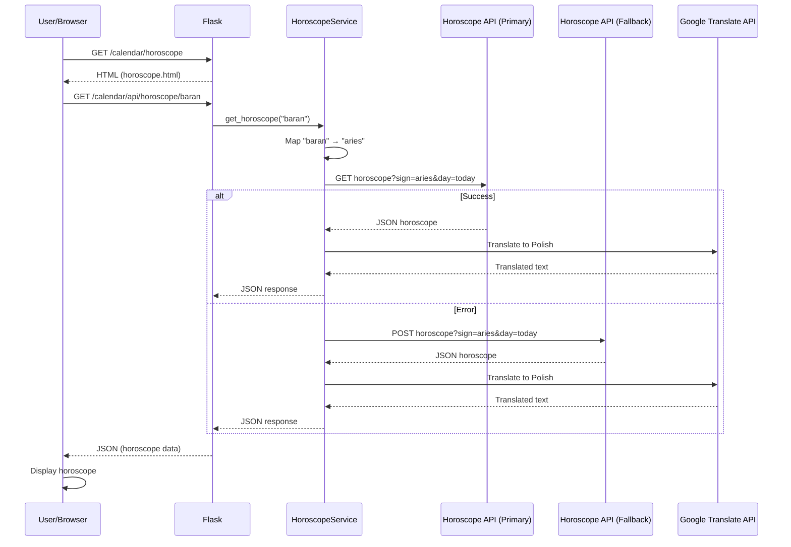
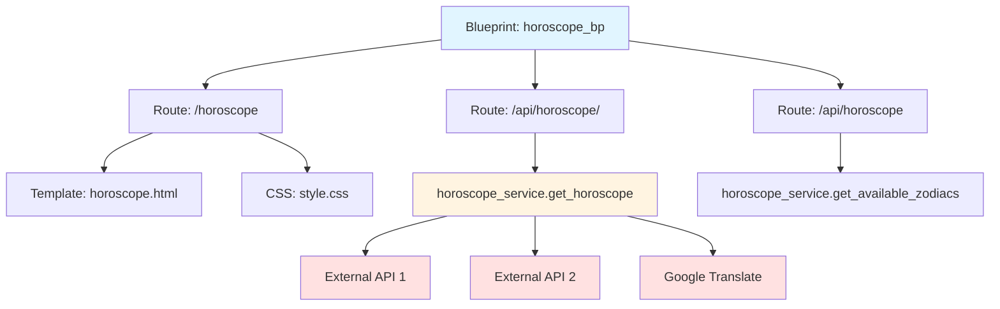

# Architektura modułu: Moduł Kalendarza

> **Cel dokumentu:**  
> Ten dokument odpowiada na pytanie: **„Jak ten konkretny moduł działa i na jakich danych operuje?”**  
>
> Ten plik opisuje architekturę **modułu kalendarza**, który odpowiada za wyświetlanie horoskopów oraz danych kalendarzowych (data, święta, imieniny).

---

## 1. Cel modułu

Moduł kalendarza jest odpowiedzialny za dostarczanie użytkownikom funkcjonalności związanych z kalendarzem oraz horoskopami. Moduł składa się z dwóch głównych komponentów:
- **Horoskopy** – pobieranie i wyświetlanie dziennych horoskopów dla wszystkich znaków zodiaku
- **Dane kalendarzowe** – informacje o aktualnej dacie, dniu roku, świętach państwowych oraz imieninach

Moduł integruje się z zewnętrznymi API w celu pobrania horoskopów, a następnie tłumaczy je na język polski. Dane kalendarzowe są generowane lokalnie na podstawie bibliotek Python.

---

## 2. Zakres funkcjonalny (powiązanie z User Stories)

- **US-CAL-001** — Jako zalogowany użytkownik, po kliknięciu w kartkę z kalendarza na stronie głównej, chcę móc zobaczyć tygodniowy horoskop, aby poznać prognozę astrologiczną na najbliższy tydzień.
- **US-HOME-002** — Jako użytkownik chcę na stronie głównej zobaczyć w formie graficznej aktualną datę, imieniny, numerację dnia roku oraz informację, czy ten dzień jest wolny od pracy, czy nie, aby mieć szybki dostęp do podstawowych informacji kalendarzowych.

Pełna lista User Stories znajduje się w: [`docs/specification/user_stories.md`](../specification/user_stories.md)

---

## 3. Granice modułu (co wchodzi / co nie wchodzi)

### 3.1 Moduł odpowiada za

- Pobieranie horoskopów z zewnętrznych API
- Tłumaczenie horoskopów z języka angielskiego na polski
- Wyświetlanie widoku horoskopów (wymaga logowania)
- Dostarczanie API do pobrania horoskopów
- Generowanie danych kalendarzowych (data, święta, imieniny)
- Obsługę wszystkich 12 znaków zodiaku

### 3.2 Moduł nie odpowiada za

- Zarządzanie użytkownikami (to jest w module auth)
- Uwierzytelnianie (to jest w module auth)
- Przechowywanie historii horoskopów w bazie danych
- Integrację z innymi modułami kalendarzowymi (np. wydarzenia użytkownika)

---

## 4. Struktura kodu modułu

Moduł kalendarza ma następującą strukturę:

```
serwis_info/modules/calendar/
├── __init__.py
├── routes/
│   ├── _init_.py
│   └── horoscope_routes.py      # Endpointy horoskopów
├── services/
│   ├── _init_.py
│   └── horoscope_service.py     # Logika pobierania i tłumaczenia horoskopów
├── static/
│   └── style.css                # Style CSS dla widoku horoskopów
└── templates/
    └── horoscope.html           # Szablon HTML widoku horoskopów
```

**Pliki kluczowe:**
- `routes/horoscope_routes.py` – definicja blueprintu i endpointów HTTP
- `services/horoscope_service.py` – logika biznesowa: pobieranie horoskopów, tłumaczenie, mapowanie znaków zodiaku
- `templates/horoscope.html` – interfejs użytkownika dla horoskopów

**Uwaga:** Dane kalendarzowe (data, święta, imieniny) są generowane przez serwis `serwis_info/modules/main/routes/calendar_service.py`, który jest częścią modułu głównego, ale dostarcza dane dla modułu kalendarza.

---

## 5. Interfejs modułu

>**Uwaga:**  
>Nie powielamy szczegółów request/response – pełna specyfikacja znajduje się w [`docs/api_reference.md`](../api_reference.md).

Poniżej przedstawiono endpointy udostępniane przez ten moduł.
Szczegółowa specyfikacja każdego endpointu (parametry, odpowiedzi, błędy)
znajduje się w pliku [`docs/api_reference.md`](../api_reference.md).

| Metoda | Ścieżka | Typ | Rola w module | Powiązane User Stories | Szczegóły |
|---:|---|---|---|---|---|
| GET | `/calendar/horoscope` | HTML | Widok horoskopów (wymaga logowania) | US-CAL-001 | [`api_reference.md`](../api_reference.md#get-calendarhoroscope) |
| GET | `/calendar/api/horoscope/<zodiac_sign>` | JSON | Horoskop dla konkretnego znaku zodiaku | US-CAL-001 | [`api_reference.md`](../api_reference.md#get-calendarapihoroscopezodiac_sign) |
| GET | `/calendar/api/horoscope` | JSON | Lista dostępnych znaków zodiaku | US-CAL-001 | [`api_reference.md`](../api_reference.md#get-calendarapihoroscope) |
| GET | `/main/api/calendar` | JSON | Dane kalendarzowe (data, święta, imieniny) | US-HOME-002 | [`api_reference.md`](../api_reference.md#get-mainapicalendar) |

---

## 6. Zewnętrzne API wykorzystywane przez moduł

Moduł wykorzystuje następujące zewnętrzne API:

### 6.1 API Horoskopów

**Główne API (pierwsza próba):**
- **Nazwa:** Horoscope App API
- **URL:** `https://horoscope-app-api.vercel.app/api/v1/get-horoscope/daily`
- **Metoda:** GET
- **Parametry:**
  - `sign` – znak zodiaku po angielsku (np. "aries", "taurus")
  - `day` – dzień horoskopu (np. "today")
- **Autoryzacja:** brak (publiczne API)
- **Odpowiedź:** JSON z kluczem `success` oraz danymi horoskopu

**Zapasowe API (fallback):**
- **Nazwa:** Aztro Horoscope API
- **URL:** `https://aztro.sameerkumar.website/`
- **Metoda:** POST
- **Parametry:**
  - `sign` – znak zodiaku po angielsku (query parameter)
  - `day` – dzień horoskopu (np. "today")
- **Autoryzacja:** brak (publiczne API)
- **Odpowiedź:** JSON z opisem horoskopu, nastrojem, zgodnością, szczęśliwą liczbą

### 6.2 API Tłumaczenia

- **Nazwa:** Google Translate API (nieoficjalny endpoint)
- **URL:** `https://translate.googleapis.com/translate_a/single`
- **Metoda:** GET
- **Parametry:**
  - `client` – "gtx"
  - `sl` – język źródłowy ("en")
  - `tl` – język docelowy ("pl")
  - `dt` – "t"
  - `q` – tekst do tłumaczenia
- **Autoryzacja:** brak (publiczne API)
- **Uwaga:** Jest to nieoficjalny endpoint, który może być niestabilny

### 6.3 Konfiguracja (zmienne `.env`)

Moduł **nie wymaga** dodatkowych zmiennych środowiskowych – wszystkie API są publiczne i nie wymagają kluczy.

### 6.4 Przykład zapytania do API

```python
# Pobieranie horoskopu
url = "https://horoscope-app-api.vercel.app/api/v1/get-horoscope/daily?sign=aries&day=today"
response = requests.get(url, timeout=10)
data = response.json()

# Tłumaczenie na polski
translate_url = "https://translate.googleapis.com/translate_a/single"
params = {
    'client': 'gtx',
    'sl': 'en',
    'tl': 'pl',
    'dt': 't',
    'q': horoscope_text
}
response = requests.get(translate_url, params=params, timeout=10)
```

### 6.5 Obsługa błędów i fallback

Moduł implementuje strategię fallback:
1. Próba pobrania horoskopu z głównego API
2. W przypadku błędu lub niepowodzenia, próba z zapasowego API (Aztro)
3. W przypadku błędu obu API, zwracany jest komunikat błędu w odpowiedzi JSON
4. W przypadku błędu tłumaczenia, zwracany jest oryginalny tekst w języku angielskim

---

## 7. Model danych modułu

### 7.1 Encje bazodanowe (tabele)

Moduł kalendarza **nie posiada własnych tabel w bazie danych**. 
Wszystkie dane są pobierane z zewnętrznych API lub generowane w czasie rzeczywistym.

### 7.2 Obiekty domenowe (bez tabel w bazie)

#### Horoskop (obiekt z API)

Reprezentuje horoskop dla konkretnego znaku zodiaku.

**Struktura (główne API):**
```json
{
  "zodiac_sign": "baran",
  "zodiac_name": "Baran ♈",
  "horoscope": "Przetłumaczony tekst horoskopu...",
  "date": "2025-01-15",
  "sign": "aries",
  "success": true
}
```

**Struktura (zapasowe API):**
```json
{
  "zodiac_sign": "baran",
  "zodiac_name": "Baran ♈",
  "horoscope": "Przetłumaczony tekst horoskopu...",
  "mood": "Szczęśliwy",
  "compatibility": "Gemini",
  "lucky_number": "7",
  "lucky_time": "14:00",
  "success": true
}
```

#### Dane kalendarzowe (obiekt generowany lokalnie)

Reprezentuje dane kalendarzowe dla aktualnego dnia.

**Struktura:**
```json
{
  "date": "15 stycznia 2025",
  "day_of_year": 15,
  "namedays": ["Paweł", "Izydor"],
  "is_holiday": false,
  "holiday_name": null
}
```

**Źródła danych:**
- `date` – generowane z `date.today()`
- `day_of_year` – liczba dnia w roku
- `namedays` – z pliku JSON (`namedays.json`)
- `is_holiday`, `holiday_name` – z biblioteki `holidays` (Poland)

#### Znak zodiaku (mapping)

Mapowanie nazw znaków zodiaku między polskim i angielskim:

```python
zodiac_mapping = {
    "baran": "aries",
    "byk": "taurus",
    "bliznieta": "gemini",
    "rak": "cancer",
    "lew": "leo",
    "panna": "virgo",
    "waga": "libra",
    "skorpion": "scorpio",
    "strzelec": "sagittarius",
    "koziorozec": "capricorn",
    "wodnik": "aquarius",
    "ryby": "pisces"
}
```

### 7.3 Relacje i przepływ danych

1. **Użytkownik → Widok horoskopu**
   - Użytkownik (zalogowany) żąda widoku horoskopów
   - Flask renderuje szablon `horoscope.html`
   - Frontend wykonuje zapytania AJAX do API horoskopów

2. **API → Tłumaczenie → Użytkownik**
   - Endpoint API pobiera horoskop z zewnętrznego API
   - Tekst jest tłumaczony na polski
   - Przetłumaczony tekst jest zwracany w odpowiedzi JSON

3. **Dane kalendarzowe**
   - Endpoint `/main/api/calendar` generuje dane lokalnie
   - Dane są zwracane jako JSON do frontendu
   - Frontend wyświetla dane na stronie głównej

---

## 8. Przepływ danych w module

**Scenariusz:** Użytkownik chce zobaczyć horoskop dla znaku "Baran"

1. Użytkownik (zalogowany) otwiera stronę `/calendar/horoscope`
2. Flask renderuje szablon `horoscope.html` (endpoint wymaga `@login_required`)
3. Frontend JavaScript wykonuje zapytanie AJAX do `/calendar/api/horoscope/baran`
4. Backend (`horoscope_service.py`) mapuje "baran" → "aries"
5. Backend próbuje pobrać horoskop z głównego API
6. Jeśli sukces, tekst jest tłumaczony na polski przez Google Translate API
7. Jeśli błąd, próba z zapasowego API (Aztro)
8. Odpowiedź JSON jest zwracana do frontendu
9. Frontend wyświetla horoskop na stronie

---

## 9. Diagramy modułu (wymagane)

### 9.1 Diagram sekwencji (dla User Story: "Zalogowany użytkownik widzi horoskop")



### 9.2 Diagram komponentów modułu



---

## 10. Testowanie modułu

Szczegóły: [`docs/testing.md`](../testing.md)

### 10.1 Unit tests (pytest)

**Testowane funkcje:**
- `get_horoscope(zodiac_sign)` – walidacja znaków zodiaku, mapowanie nazw
- `translate_to_polish(text)` – obsługa błędów tłumaczenia
- `get_available_zodiacs()` – zwracanie listy znaków
- Mapowanie znaków zodiaku (polski ↔ angielski)

**Przykładowe testy:**
- Test poprawności mapowania znaków zodiaku
- Test obsługi błędnych znaków zodiaku
- Test zwracania dostępnych znaków

### 10.2 Integration tests (HTML/API)

**Testowane endpointy:**
- `GET /calendar/horoscope` – renderowanie widoku HTML (wymaga logowania)
- `GET /calendar/api/horoscope/<zodiac_sign>` – pobieranie horoskopu (mockowanie API)
- `GET /calendar/api/horoscope` – lista dostępnych znaków
- `GET /main/api/calendar` – dane kalendarzowe

**Wymagania:**
- Mockowanie zewnętrznych API (horoskopy, tłumaczenie)
- Testowanie kodów odpowiedzi HTTP
- Testowanie struktury odpowiedzi JSON

### 10.3 Acceptance tests (Playwright)

Wymaganie: **min. 1 test Playwright na każde User Story modułu**.

**Testy akceptacyjne:**
- **E2E-01** – Zalogowany użytkownik może zobaczyć stronę horoskopów
- **E2E-02** – Użytkownik może wybrać znak zodiaku i zobaczyć horoskop
- **E2E-03** – Użytkownik widzi aktualną datę, święta i imieniny na stronie głównej

**Mapowanie do User Stories:**
- E2E-01 → US-CAL-001 (horoskop dla znaku zodiaku)
- E2E-02 → US-CAL-001 (lista znaków zodiaku)
- E2E-03 → US-HOME-002 (dane kalendarzowe)

---

## 11. Ograniczenia, ryzyka, dalszy rozwój

### Ograniczenia

- Tłumaczenie korzysta z nieoficjalnego endpointu Google Translate, który może być niestabilny
- Brak cache'owania horoskopów – każde zapytanie pobiera dane z API
- Brak historii horoskopów – nie można zobaczyć horoskopów z poprzednich dni
- Horoskopy są dostępne tylko dla zalogowanych użytkowników

### Ryzyka

- Zewnętrzne API mogą być niedostępne
- Google Translate API może zostać zablokowane lub zmienione
- Brak rate limitingu – potencjalne nadużycia API

### Propozycje usprawnień

- Implementacja cache'owania horoskopów (np. Redis) na kilka godzin
- Dodanie bazy danych do przechowywania historii horoskopów
- Zastąpienie nieoficjalnego API Google Translate oficjalnym API lub lokalnym tłumaczeniem
- Dodanie możliwości wyboru języka horoskopu
- Implementacja rate limitingu dla endpointów API
- Dodanie testów E2E z mockowaniem API

---
