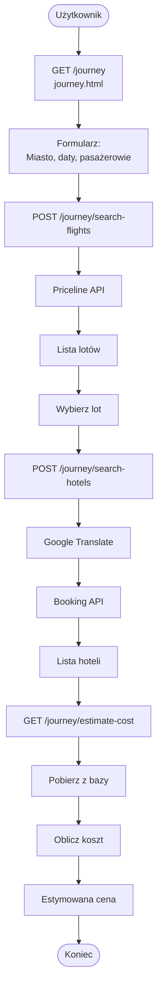
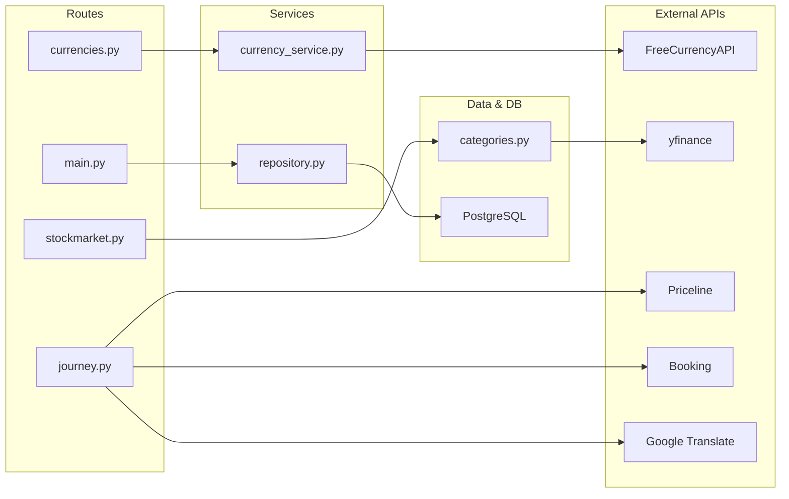

# Architektura modułu: Moduł `economy`

> **Informacja:**  
> Ten plik opisuje architekturę **modułu economy**, który zarządza kursami walut, instrumentami finansowymi i rezerwacjami podróży.  
> Architektura wspólna całej aplikacji: [`../architecture.md`](../architecture.md)

---

## 1. Cel modułu

Moduł **economy** (ekonomiczny) dostarcza funkcjonalności związane z danymi finansowymi i podróżami:
- Wyświetlanie aktualnych kursów walut z API FreeCurrencyAPI
- Przeglądanie światowych indeksów giełdowych i akcji (polskie, amerykańskie, europejskie, azjatyckie)
- Wyszukiwanie i rezerwacja lotów oraz hoteli za pośrednictwem API Priceline i Booking.com
- Zarządzanie preferencjami użytkownika (ulubione akcje, waluty, historia wyszukiwań)

---

## 2. Zakres funkcjonalny (powiązanie z User Stories)

- **US-ECO-001** - Jako użytkownik niezalogowany chcę dowiedzieć się kursu euro, dolara i franka szwajcarskiego
- **US-ECO-002** - Jako zalogowany użytkownik chcę sprawdzić historyczne dane cenowe dotyczące walut, indeksów akcyjnych oraz surowców naturalnych
- **US-ECO-003** - Jako zalogowany użytkownik chcę sprawdzić, jaka jest prawdopodobna cena mojej podróży do wybranego miejsca wyjazdu (koszty dojazdu oraz miejsca zamieszkania)
- **US-ECO-004** - Jako zalogowany użytkownik chcę sprawdzić kursy różnych walut oraz możliwość przeliczania walut
- **US-ECO-005** - Jako zalogowany użytkownik chcę na stronie głównej w okienku ekonomicznym widzieć 3 wybrane przeze mnie kursy waluty, ceny akcji lub surowców
- **US-ECO-006** - Jako zalogowany użytkownik chcę po przejściu do modułu ekonomicznego mieć możliwość grupowania w zakładki wybrane przeze mnie pozycje walutowe, akcyjne i surowcowe

Szczegóły wszystkich User Stories: [`user_stories.md`](../specification/user_stories.md#moduł-ekonomia-economy)


---

## 3. Granice modułu (co wchodzi / co nie wchodzi)

### 3.1 Moduł odpowiada za
- Pobieranie i prezentacja kursów walut (API FreeCurrencyAPI)
- Pobieranie i prezentacja danych instrumentów finansowych (akcje, indeksy, surowce) via yfinance
- Wyszukiwanie lotów (API Priceline)
- Wyszukiwanie i rezerwacja hoteli (API Booking.com)
- Zarządzanie preferencjami ekonomicznymi zalogowanego użytkownika
- Obliczanie szacunkowych kosztów podróży (loty + hotele)
- Tłumaczenie nazw miast na angielski (Google Translate)

### 3.2 Moduł nie odpowiada za
- Autentykacja i zarządzanie sesją użytkownika (obsługiwane przez auth module)
- Przechowywanie pełnej historii transakcji
- Przetwarzanie płatności
- Zarządzanie rezerwacjami (tylko wyszukiwanie i estymacja cen)

---

## 4. Struktura kodu modułu

```
exchange/
├── db/
│   ├── connection.py               # Konfiguracja połączenia z bazą
│   ├── models.py                   # Model UserEconomyPreferences
│   ├── repository.py               # CRUD operacje dla preferencji
│   └── eco_preferences_repository.py # Wrapper dla preferencji
├── routes/
│   ├── __init__.py
│   ├── main.py                     # Strona główna modułu preferencje
│   ├── currencies.py               # Endpointy dla kursów walut
│   ├── journey.py                  # Wyszukiwanie lotów i hoteli
│   └── stockmarket.py              # Indeksy giełdowe i akcje
├── services/
│   ├── __init__.py
│   └── currency_service.py         # Logika pobierania kursów walut
├── data/
│   └── categories.py               # Katalog instrumentów finansowych
├── static/
│   ├── currencies.css/.js
│   ├── journey.css/.js
│   ├── stockmarket.css/.js
│   └── eco.css
└── templates/
    ├── currencies.html             # Strona kursów walut
    ├── journey.html                # Strona wyszukiwania podróży
    └── stockmarket.html            # Strona indeksów i akcji
```

---

## 5. Interfejs modułu

| Metoda | Ścieżka | Typ | Rola w module | Powiązane User Stories | Szczegóły |
|---:|---|---|---|---|---|
| GET | /main_eco | HTML | Strona główna modułu | US-ECO-005 | [api_reference.md](../api_reference.md#exchange-main) |
| GET | /main_eco/get-preferences | JSON | Pobierz preferencje użytkownika | US-ECO-004, US-ECO-006 | [api_reference.md](../api_reference.md#exchange-get-pref) |
| PUT | /main_eco/update-preferences | JSON | Zaktualizuj preferencje | US-ECO-006 | [api_reference.md](../api_reference.md#exchange-update-pref) |
| GET | /main_eco/api/price/<symbol> | JSON | Aktualna cena instrumentu | US-ECO-004, US-ECO-005 | [api_reference.md](../api_reference.md#exchange-price) |
| GET | /currencies | HTML | Strona kursów walut | US-ECO-001, US-ECO-004 | [api_reference.md](../api_reference.md#exchange-currencies) |
| GET | /currencies/api/latest | JSON | Aktualne kursy walut | US-ECO-001, US-ECO-004 | [api_reference.md](../api_reference.md#exchange-latest-rates) |
| GET | /stockmarket | HTML | Strona indeksów giełdowych | US-ECO-002, US-ECO-004 | [api_reference.md](../api_reference.md#exchange-stockmarket) |
| GET | /stockmarket/api/search | JSON | Wyszukaj instrument finansowy | US-ECO-002, US-ECO-004 | [api_reference.md](../api_reference.md#exchange-search) |
| POST | /stockmarket/api/favorites | JSON | Dodaj do ulubionych | US-ECO-006 | [api_reference.md](../api_reference.md#exchange-favorites) |
| GET | /journey | HTML | Strona rezerwacji podróży | US-ECO-003 | [api_reference.md](../api_reference.md#exchange-journey) |
| POST | /journey/search-flights | JSON | Wyszukaj loty | US-ECO-003 | [api_reference.md](../api_reference.md#exchange-search-flights) |
| POST | /journey/search-hotels | JSON | Wyszukaj hotele | US-ECO-003 | [api_reference.md](../api_reference.md#exchange-search-hotels) |
| GET | /journey/estimate-cost | JSON | Estymacja całkowitej ceny | US-ECO-003 | [api_reference.md](../api_reference.md#exchange-estimate-cost) |

---

## 6. Zewnętrzne API wykorzystywane przez moduł

### 6.1 FreeCurrencyAPI (kursy walut)
- **Dostawca:** Free Currency API
- **Endpoint:** `https://api.freecurrencyapi.com/v1/latest`
- **Parametry:** `apikey`, `base_currency`
- **Autoryzacja:** API Key
- **Limity:** brak informacji publicznej
- **Mapowanie:** Kursy walut → kod waluty i kurs względem wybranej waluty bazowej

### 6.2 yfinance (indeksy i akcje)
- **Dostawca:** Yahoo Finance (biblioteka Python)
- **Zasoby:** Indeksy giełdowe, akcje, surowce, kryptowaluty
- **Autoryzacja:** brak
- **Limity:** brak limitu API
- **Mapowanie:** Symbol → dane cenowe (Open, High, Low, Close, Volume)

### 6.3 Priceline API (rezerwacja lotów)
- **Dostawca:** Priceline (RapidAPI)
- **Endpointy:**
  - `https://priceline-com2.p.rapidapi.com/flights/search-roundtrip`
  - `https://priceline-com2.p.rapidapi.com/flights/search-one-way`
- **Autoryzacja:** x-rapidapi-key
- **Mapowanie:** Parametry wyszukiwania (data, miasto, pasażerowie) → lista dostępnych lotów

### 6.4 Booking.com API (rezerwacja hoteli)
- **Dostawca:** Booking.com (RapidAPI)
- **Endpointy:**
  - `https://booking-com.p.rapidapi.com/v1/hotels/locations` (szukaj destynacji)
  - `https://booking-com.p.rapidapi.com/v1/hotels/search` (szukaj hoteli)
- **Autoryzacja:** x-rapidapi-key
- **Mapowanie:** Nazwa miasta → dest_id, parametry rezerwacji → lista dostępnych hoteli

### 6.5 Konfiguracja (zmienne `.env`)

| Zmienna | Typ | Opis | Wymagana |
|---|---|---|---|
| `CURRENCY_API_KEY` | string | Klucz do FreeCurrencyAPI | TAK |
| `RAPIDAPI_KEY` | string | Klucz do RapidAPI (używany dla Priceline i Booking.com) | TAK |
| `RAPIDAPI_HOST_PRICELINE` | string | Host RapidAPI dla Priceline API | TAK |
| `RAPIDAPI_HOST_BOOKING` | string | Host RapidAPI dla Booking.com API | TAK |

> Szczegóły: [`../setup.md`](../setup.md)


### 6.6 Przykłady zapytań do API

```bash
# FreeCurrencyAPI - kursy walut
curl -X GET "https://api.freecurrencyapi.com/v1/latest" \
  -H "apikey: YOUR_KEY" \
  -d "base_currency=PLN"

# yfinance - cena akcji (Python)
import yfinance as yf
ticker = yf.Ticker("AAPL")
price = ticker.history(period="1d")

# Priceline - wyszukiwanie lotów (JSON)
{
  "departureCity": "WAW",
  "arrivalCity": "JFK",
  "departureDate": "2026-03-01",
  "returnDate": "2026-03-15",
  "passengers": 2
}

# Booking.com - lokalizacja hotelu
{
  "query": "New York",
  "locale": "en-gb"
}
```

### 6.7 Obsługa błędów i fallback

- **FreeCurrencyAPI:** Jeśli API nie jest dostępne, zwróć pusty słownik; UI wyświetli "Brak danych"
- **yfinance:** Jeśli brak danych dla symbolu, zwróć pusty list
- **Priceline/Booking:** Jeśli API zwróci błąd, wyświetl komunikat błędu użytkownikowi
- **Google Translate:** Jeśli tłumaczenie się nie uda, użyj oryginalnej nazwy miasta

---

## 7. Model danych modułu

### 7.1 Encje bazodanowe (tabele)

#### `UserEconomyPreferences`
- **Rola:** Przechowuje preferencje ekonomiczne zalogowanego użytkownika
- **Kluczowe pola:**
  - `id` (Integer, PK)
  - `user_id` (Integer, FK → users.id, UNIQUE)
  - `favorite_actions` (JSON, default=[]) - ulubione akcje
  - `currencies` (ARRAY(String), default=[]) - ulubione waluty
  - `search_history` (JSON, default=[]) - historia wyszukiwań
- **Relacje:** 1:1 z User

---

### 7.2 Obiekty domenowe (bez tabel w bazie)

#### `ExchangeRateData`
```python
{
  "USD": 3.98,
  "EUR": 4.32,
  "GBP": 5.02,
  # ... więcej walut
}
```
Pochodzi z FreeCurrencyAPI; przedstawia kursy walut względem PLN.

#### `InstrumentData`
```python
{
  "symbol": "AAPL",
  "name": "Apple",
  "display": "AAPL",
  "category": "Akcje - Amerykańskie",
  "currency": "USD",
  "price": 225.50,
  "change": 1.25,
  "changePercent": 0.56
}
```
Pochodzi z yfinance; reprezentuje pojedynczy instrument finansowy.

#### `FlightOffer`
```python
{
  "airline": "LOT",
  "departureTime": "08:00",
  "arrivalTime": "12:30",
  "duration": "4h 30m",
  "price": 450,
  "currency": "PLN"
}
```
Pochodzi z Priceline API; reprezentuje ofertę lotu.

#### `HotelOffer`
```python
{
  "name": "Hotel ABC",
  "rating": 4.5,
  "pricePerNight": 200,
  "currency": "PLN",
  "nights": 5,
  "totalPrice": 1000
}
```
Pochodzi z Booking API; reprezentuje ofertę hotelu.

---

### 7.3 Relacje i przepływ danych

```
User (zalogowany)
├── UserEconomyPreferences
│   ├── favorite_actions [] → lista ulubionych symboli akcji
│   ├── currencies [] → lista ulubionych walut
│   └── search_history [] → poprzednie wyszukiwania
│
├── Zapytania do API
│   ├── FreeCurrencyAPI → ExchangeRateData
│   ├── yfinance → [InstrumentData, ...]
│   ├── Priceline → [FlightOffer, ...]
│   └── Booking.com → [HotelOffer, ...]
│
└── Journey (podróż)
    ├── Flights: [FlightOffer, ...]
    ├── Hotels: [HotelOffer, ...]
    └── EstimatedTotalCost = sum(flight_prices + hotel_prices)
```

---

## 8. Przepływ danych w module

### Scenariusz: Zalogowany użytkownik wyszukuje loty i hotele, otrzymując estymację ceny 

1. **Użytkownik przechodzi na stronę Journey** (`GET /journey`)
   - Flask renderuje [journey.html](serwis_info/modules/exchange/templates/journey.html)
   - Interfejs prosi o: wylot/przylot, daty, liczbę pasażerów, hotel, destynacja

2. **Użytkownik wybiera parametry i kliknie "Szukaj"**
   - Frontend wysyła `POST /journey/search-flights` z parametrami
   - Backend wysyła zapytanie do Priceline API

3. **Backend otrzymuje oferty lotów z Priceline**
   - Przetwarza odpowiedź i zwraca JSON z dostępnymi lotami
   - Frontend wyświetla listę dostępnych lotów

4. **Użytkownik wybiera lot i szuka hoteli**
   - Frontend wysyła `POST /journey/search-hotels` z miastem docelowym
   - Backend tłumaczy nazwę miasta (`googletrans`)
   - Backend wysyła zapytanie do Booking.com API

5. **Backend otrzymuje oferty hoteli z Booking**
   - Zwraca JSON z dostępnymi hotelami
   - Frontend wyświetla listę hoteli

6. **Użytkownik otrzymuje estymację całkowitej ceny**
   - Frontend wysyła `GET /journey/estimate-cost?flight_id=X&hotel_id=Y`
   - Backend sumuje: cena lotu + (cena hotelu × liczba nocy)
   - Zwraca całkowitą cenę w PLN

---

## 9. Diagramy modułu

### 9.1 Diagram przepływu: Wyszukiwanie podróży



### 9.2 Diagram architektury: Komponenty i zależności



---

## 10. Testowanie modułu

Szczegóły: [`../testing.md`](../testing.md)

### 10.1 Unit tests (pytest)
- `tests/unit/exchange/` - testowanie:
  - Funkcje serwisu `currency_service.py` (pobieranie i konwersja kursów)
  - Logika obliczania kosztów podróży
  - Validacja parametrów wyszukiwania
  - Obsługa błędów API (fallback)

### 10.2 Integration tests (HTML/API)
- `tests/integration/exchange/`
  - `test_currencies.py` - pełny przepływ: strona → API FreeCurrency → JSON
  - `test_journey.py` - wyszukiwanie lotów i hoteli
  - `test_eco_preferences.py` - zapis/odczyt preferencji z bazy
  - `test_main.py` - strona główna modułu

### 10.3 Acceptance tests (Playwright)
- `tests/e2e/exchange/`
  - `test_currencies_logged_user.py` - zalogowany użytkownik przegląda waluty i dodaje do ulubionych
  - `test_stockmarket_logged_user.py` - przegląd akcji i dodanie do ulubionych
  - `test_journey_estimated_cost.py` - wyszukiwanie lotu+hotelu i otrzymanie szacunkowej ceny
  - `test_favourites_logged_user.py` - zarządzanie ulubionymi instrumentami

---

## 11. Ograniczenia, ryzyka, dalszy rozwój

### Ograniczenia
- **Limity API:** Brak obsługi limitów rate-limit dla FreeCurrencyAPI
- **Brak caching:** Każde zapytanie idzie do API; brak cache'a dla kursów walut
- **Brak historii cen:** yfinance dostarcza tylko aktualne dane; brak zapisania historii w bazie
- **Tłumaczenie miast:** Google Translate nie zawsze poprawnie tłumaczy nazwy miast; może prowadzić do błędów w Booking API
- **Rezerwacje niezapisywane:** Wyszukiwanie zwraca tylko estymacje; faktyczne rezerwacje nie są zapisywane w systemie

### Ryzyka
- **Awaryjność API:** Jeśli API zewnętrzne są niedostępne, użytkownik nie może wyszukiwać
- **Niedostępność danych:** Brak danych dla wybranych walut lub instrumentów finansowych

### Dalszy rozwój
- [ ] Dodać caching dla kursów walut (TTL: 1 godzina)
- [ ] Dodać historię cen akcji - zapisywać ceny w bazie co N godzin
- [ ] Implementować pełny workflow rezerwacji (nie tylko estymacji)
- [ ] Dodać porównywanie ofert między różnymi dostawcami
- [ ] Implementować alerty cen (powiadomienie, gdy cena akcji zmienia się)
- [ ] Ulepszyć obsługę błędów i fallbacków dla API
- [ ] Dodać testy zaawansowane (chaos testing, performance testing)
