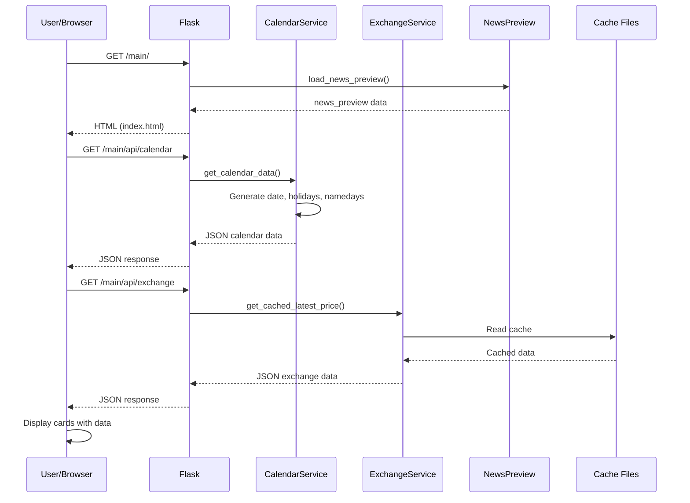
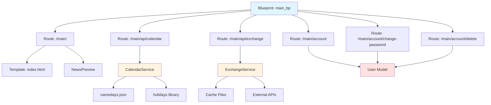

# Architektura modułu: Strona główna (Home)

> **Cel dokumentu:**  
> Ten dokument odpowiada na pytanie: **„Jak ten konkretny moduł działa i na jakich danych operuje?"**  
>
> Ten plik opisuje architekturę **modułu strony głównej**, który odpowiada za agregację informacji z różnych modułów, nawigację oraz zarządzanie kontem użytkownika.

---

## 1. Cel modułu

Moduł strony głównej (Home) jest centralnym punktem aplikacji, który agreguje i prezentuje skróty informacji z różnych modułów systemu. Moduł odpowiada za:
- Wyświetlanie strony głównej z kartami nawigacyjnymi do poszczególnych modułów
- Agregację danych z modułów (pogoda, ekonomia, wiadomości, kalendarz) w formie podglądów
- Zarządzanie kontem użytkownika (ustawienia, zmiana hasła, usuwanie konta)
- Dostarczanie API dla danych kalendarzowych i ekonomicznych wyświetlanych na stronie głównej
- Wyświetlanie modala powitalnego dla nowych użytkowników

Moduł pełni rolę hubu nawigacyjnego, umożliwiając użytkownikom szybki dostęp do wszystkich funkcjonalności aplikacji.

---

## 2. Zakres funkcjonalny (powiązanie z User Stories)

- **US-HOME-001** — Jako użytkownik chcę zobaczyć stronę główną aplikacji, która umożliwia wybór modułu i przejście do podstrony modułu, aby móc łatwo nawigować po aplikacji i uzyskać dostęp do różnych funkcjonalności.
- **US-HOME-002** — Jako użytkownik chcę na stronie głównej zobaczyć w formie graficznej aktualną datę, imieniny, numerację dnia roku oraz informację, czy ten dzień jest wolny od pracy, czy nie, aby mieć szybki dostęp do podstawowych informacji kalendarzowych.
- **US-HOME-003** — Jako zalogowany użytkownik chcę po kliknięciu w kartkę z kalendarza na stronie głównej móc zobaczyć tygodniowy horoskop, aby poznać prognozę astrologiczną na najbliższy tydzień.

Pełna lista User Stories znajduje się w: [`specification/user_stories.md`](../specification/user_stories.md)

---

## 3. Granice modułu (co wchodzi / co nie wchodzi)

### 3.1 Moduł odpowiada za

- Renderowanie strony głównej z kartami nawigacyjnymi
- Agregację i wyświetlanie podglądów danych z innych modułów (pogoda, ekonomia, wiadomości, kalendarz)
- Zarządzanie kontem użytkownika (ustawienia, zmiana hasła, usuwanie konta)
- Dostarczanie API dla danych kalendarzowych (`/main/api/calendar`)
- Dostarczanie API dla danych ekonomicznych (`/main/api/exchange`)
- Wyświetlanie modala powitalnego dla nowych użytkowników
- Integrację z modułem kalendarza (wyświetlanie danych kalendarzowych na stronie głównej)

### 3.2 Moduł nie odpowiada za

- Logowanie i rejestrację użytkowników (to jest w module auth)
- Szczegółowe funkcjonalności modułów (pogoda, ekonomia, wiadomości, kalendarz)
- Horoskopy (to jest w module calendar)
- Przechowywanie danych użytkownika w bazie (to jest w module auth)

---

## 4. Struktura kodu modułu

Moduł strony głównej ma następującą strukturę:

```
serwis_info/modules/main/
├── routes/
│   ├── __init__.py
│   ├── main.py                    # Główne endpointy (strona główna, zarządzanie kontem)
│   ├── calendar_service.py        # Serwis danych kalendarzowych
│   ├── exchange_service.py        # Serwis danych ekonomicznych
│   ├── news_preview.py            # Serwis podglądu wiadomości
│   ├── namedays.json              # Dane imienin
│   ├── gold_history_cache.json    # Cache historii cen złota
│   └── currency_history_cache.json # Cache historii kursów walut
├── static/
│   ├── mainpage.css               # Style strony głównej
│   ├── calendar.css               # Style kalendarza na stronie głównej
│   ├── weather_card.css           # Style karty pogody
│   ├── economy_card.css           # Style karty ekonomii
│   ├── news_card.css              # Style karty wiadomości
│   ├── welcome_modal.css          # Style modala powitalnego
│   ├── script.js                  # Główny skrypt JavaScript strony głównej
│   ├── news_carousel.js           # Karuzela wiadomości
│   └── auth/                      # Style dla zarządzania kontem
│       ├── account_settings.css
│       ├── change_password.css
│       └── ...
└── templates/
    ├── index.html                 # Szablon strony głównej
    ├── account_settings.html      # Ustawienia konta
    ├── account_more_options.html  # Dodatkowe opcje konta
    ├── change_password.html       # Zmiana hasła
    ├── login.html                 # Formularz logowania (używany przez auth)
    └── register.html              # Formularz rejestracji (używany przez auth)
```

**Pliki kluczowe:**
- `routes/main.py` – główne endpointy HTTP (strona główna, zarządzanie kontem, API)
- `routes/calendar_service.py` – generowanie danych kalendarzowych (data, święta, imieniny)
- `routes/exchange_service.py` – pobieranie i cache'owanie danych ekonomicznych
- `routes/news_preview.py` – pobieranie podglądu wiadomości
- `templates/index.html` – główny szablon strony głównej z kartami modułów

---

## 5. Interfejs modułu

>**Uwaga:**  
>Nie powielamy szczegółów request/response – pełna specyfikacja znajduje się w [`api_reference.md`](../api_reference.md).

Poniżej przedstawiono endpointy udostępniane przez ten moduł.
Szczegółowa specyfikacja każdego endpointu (parametry, odpowiedzi, błędy)
znajduje się w pliku [`api_reference.md`](../api_reference.md).

| Metoda | Ścieżka | Typ | Rola w module | Powiązane User Stories | Szczegóły |
|---:|---|---|---|---|---|
| GET | `/main/` | HTML | Strona główna z kartami modułów | US-HOME-001 | [`api_reference.md`](../api_reference.md#get-main) |
| GET | `/main/api/calendar` | JSON | Dane kalendarzowe (data, święta, imieniny) | US-HOME-002 | [`api_reference.md`](../api_reference.md#get-mainapicalendar) |
| GET | `/main/api/exchange` | JSON | Dane ekonomiczne (kursy walut, cena złota) | US-HOME-001 | [`api_reference.md`](../api_reference.md#get-mainapiexchange) |
| GET | `/main/account` | HTML | Ustawienia konta (wymaga logowania) | US-AUTH-003 | [`api_reference.md`](../api_reference.md#get-mainaccount) |
| GET | `/main/account/more-options` | HTML | Dodatkowe opcje konta (wymaga logowania) | US-AUTH-003 | [`api_reference.md`](../api_reference.md#get-mainaccountmore-options) |
| GET/POST | `/main/account/change-password` | HTML/Redirect | Zmiana hasła (wymaga logowania) | US-AUTH-003 | [`api_reference.md`](../api_reference.md#post-mainaccountchange-password) |
| POST | `/main/account/delete` | Redirect | Usunięcie konta (wymaga logowania) | US-AUTH-003 | [`api_reference.md`](../api_reference.md#post-mainaccountdelete) |

---

## 6. Zewnętrzne API wykorzystywane przez moduł

Moduł strony głównej **nie korzysta bezpośrednio z zewnętrznych API**. 
Dane są pobierane przez serwisy wewnętrzne, które mogą korzystać z zewnętrznych API:

- **Dane ekonomiczne** (`exchange_service.py`) – pobiera dane z zewnętrznych API (kursy walut, cena złota), ale szczegóły są w module economy
- **Dane kalendarzowe** (`calendar_service.py`) – generowane lokalnie z biblioteki `holidays` i pliku JSON z imieninami
- **Podgląd wiadomości** (`news_preview.py`) – pobiera dane z modułu news

### 6.1 Biblioteki zewnętrzne

Moduł wykorzystuje następujące biblioteki:
- **holidays** – do określania świąt państwowych w Polsce
- **threading** – do asynchronicznego pobierania danych w tle (cache'owanie)

---

## 7. Model danych modułu

### 7.1 Encje bazodanowe (tabele)

Moduł strony głównej **nie posiada własnych tabel w bazie danych**. 
Wykorzystuje encję `User` z modułu auth do zarządzania kontem.

### 7.2 Obiekty domenowe (bez tabel w bazie)

#### Dane kalendarzowe (obiekt generowany lokalnie)

Reprezentuje dane kalendarzowe dla aktualnego dnia.

**Struktura:**
```json
{
  "date": "15 stycznia 2025",
  "day_of_year": 15,
  "namedays": ["Paweł", "Izydor"],
  "is_holiday": false,
  "holiday_name": null
}
```

**Źródła danych:**
- `date` – generowane z `date.today()`
- `day_of_year` – liczba dnia w roku
- `namedays` – z pliku JSON (`namedays.json`)
- `is_holiday`, `holiday_name` – z biblioteki `holidays` (Poland)

#### Dane ekonomiczne (obiekt z cache/API)

Reprezentuje dane ekonomiczne wyświetlane na stronie głównej.

**Struktura:**
```json
{
  "eur_pln": 4.32,
  "usd_pln": 3.98,
  "gold_price": 285.50,
  "gold_history": [...],
  "usd_history": [...],
  "eur_history": [...]
}
```

**Źródła danych:**
- Pobierane z `exchange_service.py`
- Cache'owane w plikach JSON (`gold_history_cache.json`, `currency_history_cache.json`)

#### Podgląd wiadomości (obiekt z modułu news)

Reprezentuje podgląd najnowszych wiadomości.

**Struktura:**
- Pobierane z modułu news przez `news_preview.py`
- Szczegóły struktury w dokumentacji modułu news

### 7.3 Relacje i przepływ danych

1. **Strona główna → Agregacja danych:**
   - Frontend wykonuje zapytania AJAX do `/main/api/calendar` i `/main/api/exchange`
   - Dane są wyświetlane w kartach na stronie głównej
   - Podgląd wiadomości jest ładowany bezpośrednio w template

2. **Zarządzanie kontem:**
   - Użytkownik (zalogowany) żąda `/main/account`
   - Flask renderuje szablon z ustawieniami konta
   - Zmiana hasła/usunięcie konta wykorzystuje model `User` z modułu auth

3. **Cache'owanie danych:**
   - Dane ekonomiczne są cache'owane w plikach JSON
   - Odświeżanie cache odbywa się asynchronicznie w tle (threading)

---

## 8. Przepływ danych w module

**Scenariusz:** Użytkownik otwiera stronę główną

1. Użytkownik żąda `/main/`
2. Flask renderuje szablon `index.html`
3. Frontend JavaScript wykonuje zapytania AJAX:
   - `GET /main/api/calendar` → dane kalendarzowe
   - `GET /main/api/exchange` → dane ekonomiczne
4. Backend (`calendar_service.py`) generuje dane kalendarzowe lokalnie
5. Backend (`exchange_service.py`) pobiera dane z cache lub zewnętrznego API
6. Jeśli cache jest pusty, dane są pobierane w tle (threading)
7. Odpowiedzi JSON są zwracane do frontendu
8. Frontend wyświetla dane w odpowiednich kartach na stronie głównej
9. Jeśli użytkownik jest nowy (flaga `show_welcome_modal`), wyświetlany jest modal powitalny

---

## 9. Diagramy modułu (wymagane)

### 9.1 Diagram sekwencji (dla User Story: "Użytkownik widzi stronę główną")



### 9.2 Diagram komponentów modułu



---

## 10. Testowanie modułu

Szczegóły: [`testing.md`](../testing.md)

### 10.1 Unit tests (pytest)

**Testowane funkcje:**
- `get_calendar_data()` – generowanie danych kalendarzowych
- `_load_news_preview()` – pobieranie podglądu wiadomości
- Walidacja formularzy zarządzania kontem

**Przykładowe testy:**
- Test generowania danych kalendarzowych dla różnych dat
- Test obsługi świąt państwowych
- Test pobierania imienin z pliku JSON
- Test walidacji zmiany hasła

### 10.2 Integration tests (HTML/API)

**Testowane endpointy:**
- `GET /main/` – renderowanie strony głównej
- `GET /main/api/calendar` – pobieranie danych kalendarzowych
- `GET /main/api/exchange` – pobieranie danych ekonomicznych (z mockowaniem API)
- `GET /main/account` – ustawienia konta (wymaga logowania)
- `POST /main/account/change-password` – zmiana hasła (wymaga logowania)
- `POST /main/account/delete` – usunięcie konta (wymaga logowania)

**Wymagania:**
- Mockowanie zewnętrznych API (dane ekonomiczne)
- Testowanie kodów odpowiedzi HTTP
- Testowanie struktury odpowiedzi JSON
- Testowanie sesji Flask-Login

### 10.3 Acceptance tests (Playwright)

Wymaganie: **min. 1 test Playwright na każde User Story modułu**.

**Testy akceptacyjne:**
- **E2E-01** – Użytkownik może zobaczyć stronę główną z kartami modułów
- **E2E-02** – Użytkownik widzi aktualną datę, święta i imieniny na stronie głównej
- **E2E-03** – Zalogowany użytkownik może zmienić hasło
- **E2E-04** – Zalogowany użytkownik może usunąć konto
- **E2E-05** – Nowy użytkownik widzi modal powitalny

**Mapowanie do User Stories:**
- E2E-01 → US-HOME-001 (strona główna)
- E2E-02 → US-HOME-002 (dane kalendarzowe)
- E2E-03 → US-AUTH-003 (zmiana hasła)
- E2E-04 → US-AUTH-003 (usunięcie konta)

---

## 11. Ograniczenia, ryzyka, dalszy rozwój

### Ograniczenia

- Dane ekonomiczne są cache'owane lokalnie w plikach JSON (brak centralnego cache)
- Brak automatycznego odświeżania danych na stronie głównej (wymaga odświeżenia strony)
- Modal powitalny jest wyświetlany tylko raz po rejestracji (flaga sesji)
- Dane kalendarzowe są generowane tylko dla aktualnego dnia (brak historii)

### Ryzyka

- Cache danych ekonomicznych może być nieaktualny
- Pliki cache JSON mogą być uszkodzone
- Brak walidacji danych z cache przed wyświetleniem

### Propozycje usprawnień

- Implementacja centralnego cache (np. Redis) dla danych ekonomicznych
- Automatyczne odświeżanie danych na stronie głównej (WebSocket lub polling)
- Rozszerzenie danych kalendarzowych o historię i prognozy
- Dodanie walidacji i obsługi błędów dla cache'owanych danych
- Implementacja systemu powiadomień dla użytkowników
- Dodanie możliwości personalizacji układu strony głównej

---
