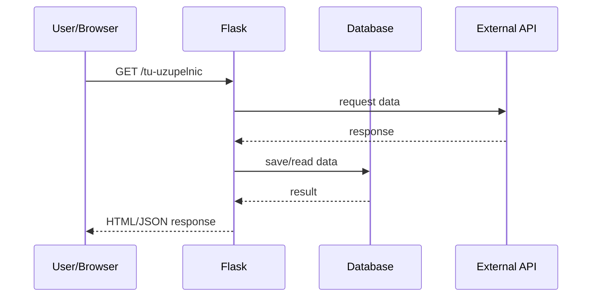

# Architektura modułu: Moduł `weather`

> **Cel dokumentu:**  
> Ten dokument odpowiada na pytanie: **„Jak moduł pogodowy działa i na jakich danych operuje?”**

 
> Architektura wspólna całej aplikacji: [`doc/architecture.md`](../architecture.md)

---

## 1. Cel modułu

Moduł `weather` odpowiada za prezentację danych pogodowych w serwisie informacyjnym.  
Umożliwia użytkownikowi wyszukiwanie pogody dla miast, wyświetlanie prognoz, alertów pogodowych oraz map pogodowych.  
Moduł integruje się z zewnętrznym API OpenWeatherMap i przechowuje historię wyszukiwań użytkownika.  
Część funkcjonalności (historia, panel użytkownika) dostępna jest tylko dla zalogowanych użytkowników.

---

## 2. Zakres funkcjonalny (powiązanie z User Stories)

**TU UZUPEŁNIĆ:** wstaw listę User Stories (ID z Jiry + krótki opis).

- **US-WEATHER-01** - Jako użytkownik chcę wyszukać aktualną pogodę dla miasta.
- **US-WEATHER-02** - Jako użytkownik chcę zobaczyć prognozę godzinową i dzienną.
- **US-WEATHER-03** - Jako użytkownik chcę zobaczyć mapę pogodową z warstwami (temperatura, opady, wiatr).
- **US-WEATHER-04** - Jako zalogowany użytkownik chcę mieć zapisaną historię wyszukiwań.
- **US-WEATHER-05** - Jako użytkownik chcę otrzymać ostrzeżenia pogodowe (upał, mróz, silny wiatr).


---

## 3. Granice modułu (co wchodzi / co nie wchodzi)

### 3.1 Moduł odpowiada za
- komunikację z API OpenWeatherMap,
- logikę pogodową (prognozy, alerty, mapy),
- przechowywanie historii wyszukiwań miast,
- frontend panelu pogodowego.

### 3.2 Moduł nie odpowiada za
- autoryzację i logowanie użytkownika (moduł `auth`),
- globalną nawigację i layout aplikacji,
- zarządzanie kontem użytkownika.

---

## 4. Struktura kodu modułu

modules/weather/
├── db/
│ ├── connection.py
│ ├── history_repository.py
│ └── user_repository.py
├── routes/
│ ├── weather_routes.py
│ ├── history_routes.py
│ └── dashboard_routes.py
├── services/
│ └── history_services.py
├── static/
│ ├── js/
│ │ ├── app.js
│ │ ├── search.js
│ │ ├── forecast.js
│ │ ├── alerts.js
│ │ └── mapControls.js
│ └── style.css
└── templates/
└── dashboard.html

- **routes/** – endpointy HTTP (API + HTML)
- **services/** – logika biznesowa
- **db/** – dostęp do SQLite
- **static/** – frontend JS
- **templates/** – widoki HTML

---

## 5. Interfejs modułu

>**Instrukcja:**
>Nie powielaj szczegółów request/response – pełna specyfikacja znajduje się w api_reference.md.

Poniżej przedstawiono endpointy udostępniane przez ten moduł.
Szczegółowa specyfikacja każdego endpointu (parametry, odpowiedzi, błędy)
znajduje się w pliku [`doc/api_reference.md`](../api_reference.md).

>**PRZYKŁAD TABELI:** dostosuj do swojego modułu.

| Metoda | Ścieżka | Typ | Rola w module | Powiązane US | Szczegóły |
|---:|---|---|---|---|---|
| GET | /weather/dashboard | HTML | Panel pogodowy | US-WEATHER-01 | api_reference.md#weather-dashboard |
| GET | /weather/api/simple_weather | JSON | Aktualna pogoda | US-WEATHER-01 | api_reference.md#simple-weather |
| GET | /weather/api/forecast | JSON | Prognoza 3-dniowa | US-WEATHER-02 | api_reference.md#forecast |
| GET | /weather/api/history/{username} | JSON | Historia wyszukiwań | US-WEATHER-04 | api_reference.md#history |
| POST | /weather/api/history/{username} | JSON | Dodanie wpisu | US-WEATHER-04 | api_reference.md#history-add |
| DELETE | /weather/api/history/{username} | JSON | Czyszczenie historii | US-WEATHER-04 | api_reference.md#history-delete |


---

## 6. Zewnętrzne API wykorzystywane przez moduł

Moduł korzysta z **OpenWeatherMap API**.

- Dostawca: OpenWeather Ltd.
- Autoryzacja: API Key
- Format danych: JSON
- Limity: zależne od planu OpenWeather

### Wykorzystywane endpointy
- `/data/2.5/weather`
- `/data/2.5/forecast`
- `/data/2.5/air_pollution`
- `/map/{layer}/{z}/{x}/{y}.png`

### 6.1 Konfiguracja (zmienne `.env`)

Wpisz zmienne używane do konfiguracji API:


| Zmienna | Przykład | Opis | Wymagana |
|---|---|---|---|
| OPENWEATHER_API_KEY | abc123 | Klucz API OpenWeather | TAK |

### 6.2 Przykład zapytania do API (opcjonalnie)

```bash
curl "https://api.openweathermap.org/data/2.5/weather?q=Warsaw&appid=API_KEY&units=metric"

### 6.3 Obsługa błędów i fallback
brak odpowiedzi API → komunikat błędu w UI,

niepoprawna nazwa miasta → informacja „Nie znaleziono miasta”,

brak klucza API → brak danych pogodowych.

---

## 7. Model danych modułu

> **Cel tej sekcji:**  
> Opisać **wszystkie dane**, na których operuje moduł.  
> Obejmuje to zarówno **encje bazodanowe**, jak i **obiekty domenowe bez własnych tabel**.

> **Ważne:**  
> Nie powtarzaj tutaj pełnego opisu encji wspólnych całej aplikacji  
> (np. `User`). Możesz się do nich odwołać.

---

### 7.1 Encje bazodanowe (tabele)

users

rola: identyfikacja użytkownika modułu,

pola: id, username,

relacja: 1:N z history.

history

rola: historia wyszukiwań miast,

pola: id, username, query, timestamp,

relacja: wiele wpisów dla jednego użytkownika.

---

### 7.2 Obiekty domenowe (bez tabel w bazie)

Opisz obiekty:
- pochodzące z API,
- tworzone w logice modułu.

WeatherData – dane bieżącej pogody z API,

ForecastItem – prognoza godzinowa/dzienna,

WeatherAlert – ostrzeżenia pogodowe (logika JS),

MapLayer – warstwy map pogodowych.

---

### 7.3 Relacje i przepływ danych

Opisz relacje i przepływ danych.

Użytkownik → frontend JS → backend Flask → OpenWeather API → backend → frontend.
Historia wyszukiwań zapisywana jest lokalnie w SQLite.

---

## 8. Przepływ danych w module

Opisz 1 kluczowy scenariusz krok po kroku.
>**Instrukcja:** Scenariusz powinien odpowiadać jednej z User Stories wymienionych w sekcji 2.

Scenariusz: wyszukiwanie miasta

1. Użytkownik wpisuje nazwę miasta i klika „Szukaj”.

2. Frontend wysyła zapytanie do OpenWeather API.

3. Backend zapisuje miasto w historii użytkownika.

4. Dane pogodowe są wyświetlane w panelu oraz na mapie.

---

## 9. Diagramy modułu (wymagane)

### 9.1 Diagram sekwencji (dla 1 user story)

**Opcja: Mermaid**


```mermaid
sequenceDiagram
  participant U as User
  participant JS as Frontend JS
  participant F as Flask
  participant API as OpenWeather API
  participant DB as SQLite

  U->>JS: Wyszukaj miasto
  JS->>API: Pobierz pogodę
  API-->>JS: Dane pogodowe
  JS->>F: POST /api/history
  F->>DB: Zapis historii
  JS-->>U: Wyświetlenie pogody
  ```

### 9.2 Diagram komponentów modułu (opcjonalnie)

**TU UZUPEŁNIĆ:** moduł, serwisy, modele, zależności.

---

## 10. Testowanie modułu

Szczegóły: [`doc/testing.md`](../testing.md)

### 10.1 Unit tests (pytest)
**TU UZUPEŁNIĆ:** co testujecie jednostkowo (np. funkcje services, walidacja).

### 10.2 Integration tests (HTML/API)
**TU UZUPEŁNIĆ:** które endpointy są testowane integracyjnie.

### 10.3 Acceptance tests (Playwright)
Wymaganie: **min. 1 test Playwright na każde User Story modułu**.

**TU UZUPEŁNIĆ:** lista testów akceptacyjnych + mapowanie do US.

---

## 11. Ograniczenia, ryzyka, dalszy rozwój

zależność od zewnętrznego API,

brak cache po stronie backendu,

możliwość rozbudowy o alerty push i zapisy ulubionych miast.
